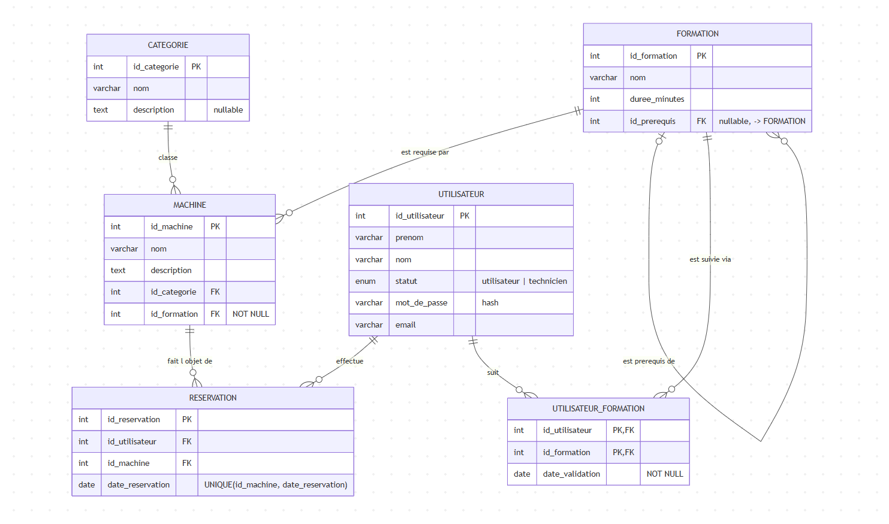

# Base de données `openlab`

Base de données d'un atelier partagé (fablab) : gestion des **machines**, des **formations** nécessaires pour les utiliser, des **utilisateurs** et de leurs **réservations**.

- SGBD : MySQL / MariaDB
- Encodage : `utf8mb4` (collation `utf8mb4_unicode_ci`)
- Script de création : [sql/create_db.sql](sql/create_db.sql)
- Jeu de données : [sql/seed_db.sql](sql/seed_db.sql) (à exécuter **après** le script de création)
- Schéma (MLD) : [sql/schema.md](sql/schema.md)

## Schéma

### Tables

| Table | Rôle |
|-------|------|
| `categorie` | Catégories de machines (ex. impression 3D, découpe laser…) |
| `machine` | Machines de l'atelier, rattachées à une catégorie et à une formation (obligatoire) |
| `formation` | Formations à suivre, avec une durée et un éventuel prérequis (auto-référence) |
| `utilisateur` | Comptes (statut `utilisateur` ou `technicien`) |
| `utilisateur_formation` | Formations validées par un utilisateur, avec date de validation (table de liaison N-N) |
| `reservation` | Réservations d'une machine par un utilisateur à une date donnée |

### Règles principales

- Chaque machine appartient à une catégorie et exige une formation (`id_formation` **non nul**).
- Une formation peut avoir une autre formation comme prérequis (`id_prerequis`, optionnel).
- Une machine ne peut être réservée qu'une fois par jour : contrainte `UNIQUE (id_machine, date_reservation)`.
