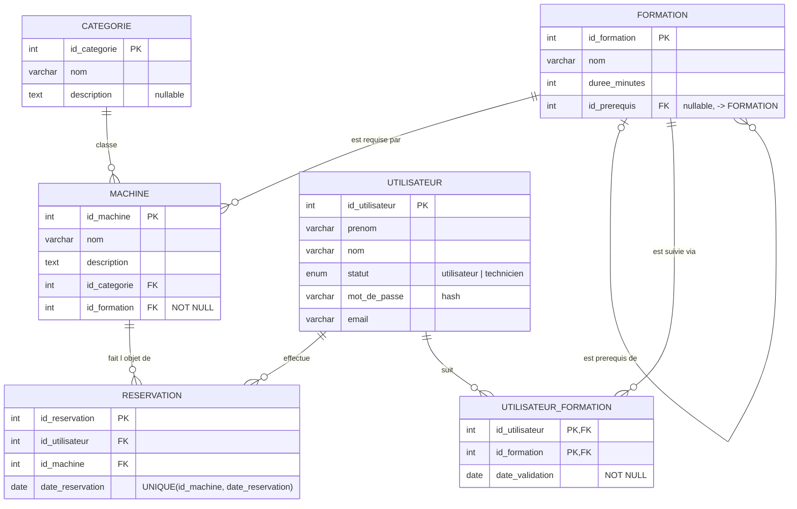

# Fablab/Openlab ESIEA

## MLD

```mermaid
erDiagram
    CATEGORIE {
        int id_categorie PK
        varchar nom
        text description "nullable"
    }
    FORMATION {
        int id_formation PK
        varchar nom
        int duree_minutes
        int id_prerequis FK "nullable, -> FORMATION"
    }
    MACHINE {
        int id_machine PK
        varchar nom
        text description
        int id_categorie FK
        int id_formation FK "NOT NULL"
    }
    UTILISATEUR {
        int id_utilisateur PK
        varchar prenom
        varchar nom
        enum statut "utilisateur | technicien"
        varchar mot_de_passe "hash"
        varchar email
    }
    UTILISATEUR_FORMATION {
        int id_utilisateur PK,FK
        int id_formation PK,FK
        date date_validation "NOT NULL"
    }
    RESERVATION {
        int id_reservation PK
        int id_utilisateur FK
        int id_machine FK
        date date_reservation "UNIQUE(id_machine, date_reservation)"
    }

    CATEGORIE   ||--o{ MACHINE        : "classe"
    FORMATION   ||--o{ MACHINE        : "est requise par"
    FORMATION   |o--o{ FORMATION      : "est prerequis de"
    UTILISATEUR ||--o{ RESERVATION    : "effectue"
    MACHINE     ||--o{ RESERVATION    : "fait l objet de"
    UTILISATEUR ||--o{ UTILISATEUR_FORMATION : "suit"
    FORMATION   ||--o{ UTILISATEUR_FORMATION : "est suivie via"

```
